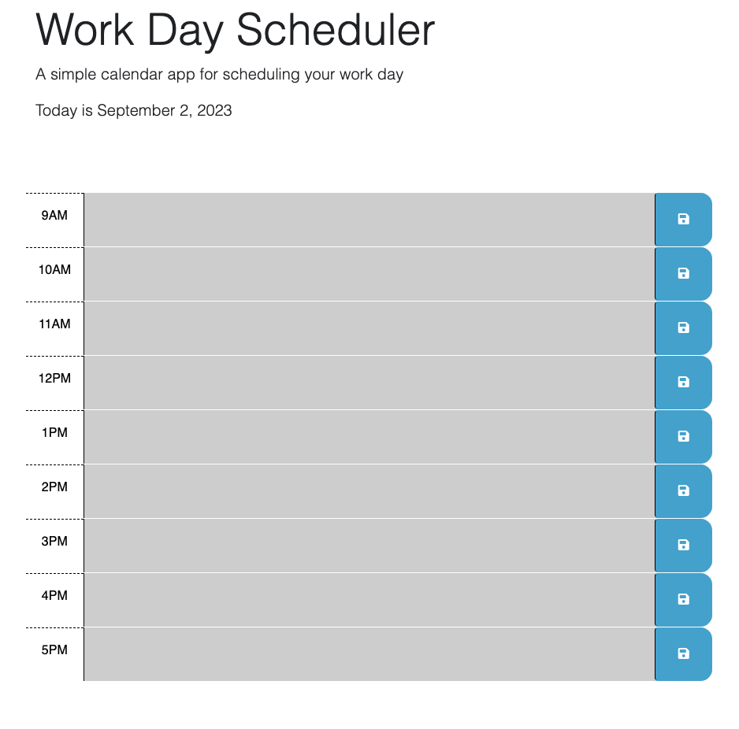

# Work Day Scheduler Starter Code
# Work Day Scheduler

## Overview
This is a simple calendar app designed to help you schedule your workday. It provides a user-friendly interface where you can enter and save events for different hours of the day. The app also color-codes time blocks to indicate whether they are in the past, present, or future.

You can access the live version of this project [here](https://leeamick.github.io/workday-scheduler/).

## Features
- Display of the current date at the top of the calendar.
- Time blocks for standard business hours (9 AM to 5 PM).
- Color-coding of time blocks based on the current time.
- Ability to click into a time block to enter an event.
- Save events to local storage for persistence.
- Saved events are loaded and displayed on page refresh.

## Usage
- The current date is displayed at the top of the calendar.
- Time blocks are color-coded:
  - Gray for past hours.
  - Red for the current hour.
  - Green for future hours.
- Click on a time block to enter an event.
- Click the save button to save your event for that time block.

## Technologies Used
- HTML
- CSS
- JavaScript
- jQuery
- [Bootstrap](https://getbootstrap.com/)
- [Day.js](https://day.js.org/)

## License
This project is licensed under the MIT License
